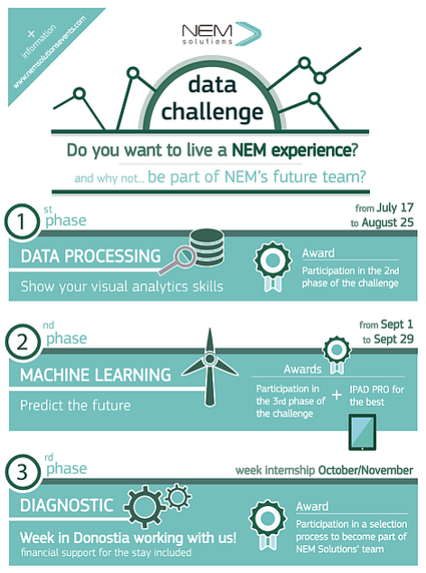

## NEM Data Challenge Winner

Back in July 2017, [NEM Solutions](http://nemsolutions.com) launched its 1st Data Challenge. The aim of the event was to identify wind energy and rail data processing professionals.

Worldwide participants were accepted and the best profiles awardeded. The first two stages were carried out online, and the last one consisted of a two-weeks internship at NEM Solutions. Further details can be found at www.nemsolutionsevents.com

The challenge was focused on the wind energy sector and in business oriented data.

In this repository you can find the Python scripts I used to solve the tasks proposed throughout the three stages together with the final reports submitted at the end of stage I and II. 

Hope you find it useful,

Sergio

